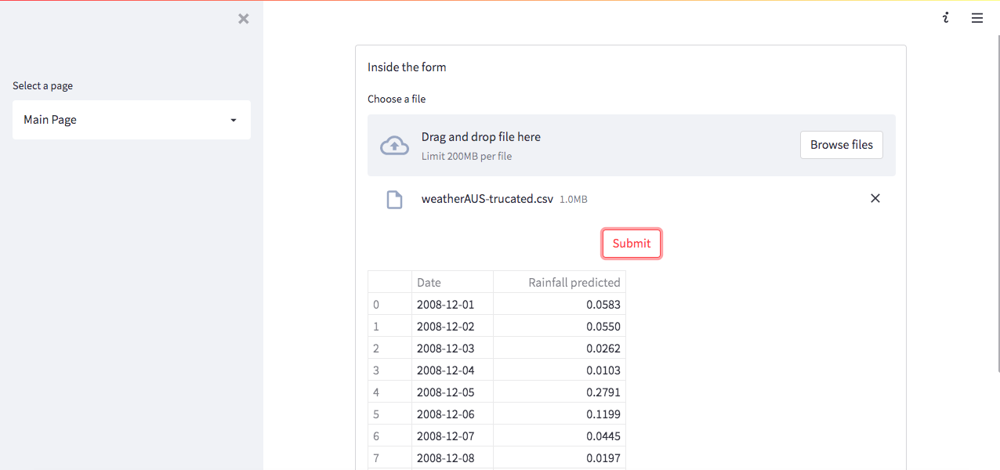
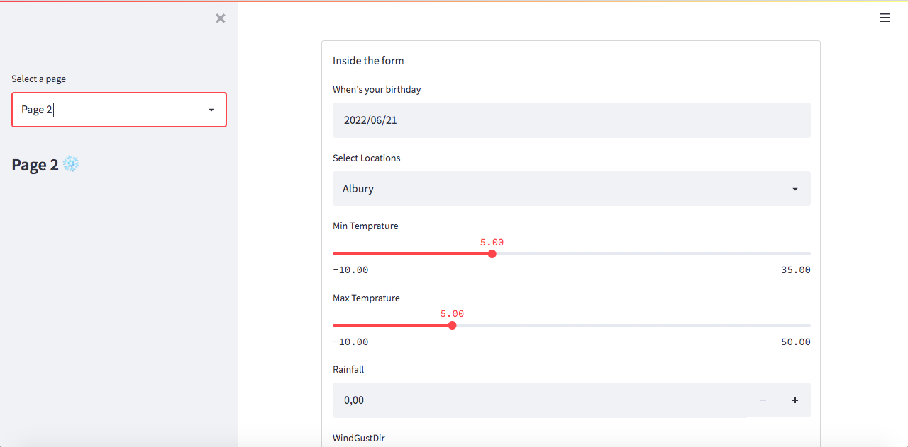

# Rainfall predictions using different statistical machine learning algorithms.

## About the project

The project consists of two pages. To predict rainfall, we may input an excel file including meteorological conditions from various days of the year using the first page. On the second screen, we may manually change the weather parameters to observe which feature contributes the most to predicting rainfall.
The code also allows you to change the statistical machine learning model and its hyperparameters to improve prediction accuracy.
A data pipeline is also built up utilizing airflow to look for fresh data and make predictions before storing it in the database.

##Page 1

On the dashboard's main page, we can upload an excel file with meteorological conditions to see the rainfall predictions for the day.

##Page 2

On the dashboard's second page, we can manipulate the meteorological conditions to see which under which conditions rainfall predictions increase / descrease.

## Project setup
  - conda create -y python=3.9 --name rainfall_predictions
  - conda activate rainfall_predictions
  - pip install -r requirements.txt
  - Rename config-dist.py to config.py and update as per your local machine configurations
  - Start postgres server
  - Create a folder data in the root directory

## To train model
  - python train.py
  - Default model used is Logistic Regression. The same can be changed from the config.py file 

## To Run API
  - uvicorn api:app --reload
  - Predictions endpoint - http://127.0.0.1:8000/predictions

## To Run Streamlit
  - streamlit run dashboard.py
  - Dashboard endpoint - http://localhost:8501/

## To Setup and run airflow
  - airflow db init
  - airflow webserver --port 8080
  - airflow scheduler
  - Airflow endpoint - http://localhost:8080
  - Make a connection on airflow for postgresh db with a connection id postgres_db

